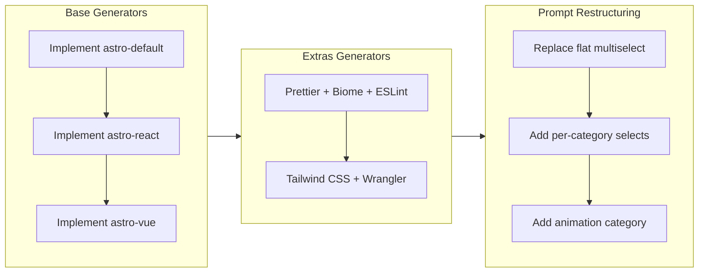

## 1. Overview

This branch implements the complete scaffolding pipeline for bungkus-cli, an Astro project generator. Starting from empty TODO stubs, the developer built all base template generators, config-file extras (Prettier, Biome, ESLint), Astro integration extras (Tailwind CSS, Wrangler), then restructured the CLI from a flat multiselect into categorized prompts, and finally added animation library support (Motion, GSAP, Anime.js).

**Highlights:**

1. Implemented three base generators using giget to scaffold Astro, Astro+React, and Astro+Vue starter templates
2. Built five extras generators covering formatting, linting, CSS frameworks, deployment, and animation libraries
3. Restructured the CLI prompt flow from a flat multiselect into distinct per-category select prompts for better UX

## 2. Motivation

The bungkus-cli project had a complete architectural skeleton -- types, prompt definitions, scaffold orchestrator, and generator registries -- but every generator was a TODO stub. The goal of this branch was to bring the tool from a non-functional prototype to a working scaffolding CLI that could produce real Astro projects with user-selected tooling. Along the way, it became clear that the flat extras multiselect was a poor UX fit for mutually exclusive choices (Prettier vs Biome), which motivated the prompt restructuring mid-stream.

## 3. Journey

The work progressed in three distinct phases. First, the base generators were implemented using giget to download official Astro starter templates. Next, the extras generators were built in two batches: config-file generators (Prettier, Biome, ESLint) that write standalone config files, and integration generators (Tailwind CSS, Wrangler) that use magicast to modify astro.config.mjs. Finally, the developer recognized that the flat multiselect prompt conflated independent choices and restructured it into per-category selects, then extended the pattern with a new animation library category.

## 4. Changes

### 4-1. Implement base generators for Astro project scaffolding ([afb1154](https://github.com/spencer-osbrjp/bungkus-cli/commit/afb1154))

Implemented the three base generators (astro-default, astro-react, astro-vue) using giget's downloadTemplate to clone official Astro starter templates, then patching package.json to set the project name.

### 4-2. Implement config-file extras generators (Prettier, Biome, ESLint) ([01cfd04](https://github.com/spencer-osbrjp/bungkus-cli/commit/01cfd04))

Built three config-file extras generators that add devDependencies to package.json and write their respective config files (.prettierrc, biome.json, eslint.config.js) with sensible Astro-aware defaults.

### 4-3. Implement Astro integration extras generators (Tailwind CSS, Wrangler) ([9fc9a27](https://github.com/spencer-osbrjp/bungkus-cli/commit/9fc9a27))

Implemented the two integration-level extras generators that use magicast to programmatically modify astro.config.mjs, adding Tailwind CSS integration and Cloudflare adapter respectively.

### 4-4. Restructure CLI prompts from single extras multiselect to distinct category prompts ([8d99fbb](https://github.com/spencer-osbrjp/bungkus-cli/commit/8d99fbb))

Replaced the flat extras multiselect with four dedicated sequential prompts (CSS framework, Formatter, Linter, Deploy target), improving UX by making choices clearer and enforcing mutual exclusivity between Prettier and Biome.

### 4-5. Add animation library prompt category to CLI ([90644ee](https://github.com/spencer-osbrjp/bungkus-cli/commit/90644ee))

Extended the restructured prompt system with a new animation category offering Motion, GSAP, and Anime.js, along with three new dependency-only generators.

## 5. Outcome

All eight generator TODO stubs were completed, transforming bungkus-cli from a non-functional skeleton into a working Astro project scaffolder. The CLI now guides users through six sequential prompts (project name, base template, CSS framework, formatter, linter, deploy target, animation library) and produces a fully configured project directory. The prompt restructuring improved the user experience by separating independent tooling choices into distinct categories.

## 6. Historical Analysis

No related historical context. This is the first feature branch on a greenfield project.

## 7. Concerns

- The magicast integration for modifying astro.config.mjs contains TODO comments indicating incomplete AST manipulation for adding imports and function calls (see [9fc9a27](https://github.com/spencer-osbrjp/bungkus-cli/commit/9fc9a27) in `src/generators/extras/tailwindcss.ts` and `src/generators/extras/wrangler.ts`)
- The `extraGenerators` record was typed as `Record<string, Generator>` which loses type safety compared to the original `Record<Extra, Generator>` (see [8d99fbb](https://github.com/spencer-osbrjp/bungkus-cli/commit/8d99fbb) in `src/generators/extras/index.ts`)
- Giget template paths (e.g., `gh:withastro/astro/examples/basics`) are hard-coded and may break if Astro reorganizes its monorepo examples directory (see [afb1154](https://github.com/spencer-osbrjp/bungkus-cli/commit/afb1154) in `src/generators/base/astro-default.ts`)
- No error handling for network failures during template download; raw stack traces would surface to users (see [afb1154](https://github.com/spencer-osbrjp/bungkus-cli/commit/afb1154) in `src/scaffold.ts`)

## 8. Ideas

- Extract a shared `addDevDependencies(projectDir, deps)` helper to eliminate the duplicated package.json read/write/merge pattern across all generators
- Add conflict detection when users select both Biome and ESLint, since Biome includes linting capabilities
- Implement `--preset` flag to skip interactive prompts with pre-configured combinations (e.g., `--preset cloudflare-react`)
- Add a dry-run mode that shows what files would be created without actually scaffolding
- Consider adding Svelte and Solid.js as additional base template options

## 9. Performance

**Metrics**: 10 commits over 0.66 hours (15.15 commits/hour)

### 9-1. Pace Analysis

Development velocity was high at over 15 commits per hour, reflecting the systematic nature of the work. Commits were well-scoped and followed a clear pattern: each ticket addressed a distinct set of generators or a specific refactoring concern. The work was front-loaded with implementation (base generators, then extras) and concluded with UX refinements (prompt restructuring, new category). The consistent pace suggests the architectural skeleton was well-designed, allowing rapid implementation of the generator bodies.

### 9-2. Decision Review

| Dimension      | Rating   | Notes                                                                 |
| -------------- | -------- | --------------------------------------------------------------------- |
| Consistency    | Strong   | All generators follow the same pattern: read pkg, add deps, write cfg |
| Intuitivity    | Strong   | Category-based prompts are more intuitive than flat multiselect       |
| Describability | Strong   | Each ticket has a clear single purpose                                |
| Agility        | Strong   | Mid-stream pivot to restructure prompts shows responsive design       |
| Density        | Adequate | Some commits are ticket/planning overhead rather than implementation  |

**Strengths**: The developer demonstrated good architectural judgment by recognizing the UX issue with flat multiselects mid-stream and restructuring before adding more options. The generator pattern is consistent and predictable across all implementations.

**Areas for Improvement**: The duplicated package.json read/write pattern across generators could have been extracted into a helper earlier. The magicast integration for Tailwind and Wrangler was left partially incomplete with TODO comments.

## 10. Release Preparation

**Verdict**: Needs attention before release

### 10-1. Concerns

- The Tailwind CSS and Wrangler generators contain TODO comments for incomplete magicast AST manipulation, meaning these generators may not fully configure astro.config.mjs
- No end-to-end testing has been performed on the scaffold pipeline
- Package version ranges in devDependencies are speculative and should be verified against current stable releases

### 10-2. Pre-release Instructions

- Verify that the magicast integration in tailwindcss.ts and wrangler.ts correctly modifies astro.config.mjs
- Run the CLI end-to-end with each base template and extras combination to verify scaffolded projects are functional
- Confirm giget template paths resolve to valid Astro starter repositories

### 10-3. Post-release Instructions

- None -- no special post-release actions needed

## 11. Notes

This is the initial feature branch for bungkus-cli. The version was bumped from 0.0.1 to 0.0.2 as the final commit. The project uses TypeScript with giget for template downloading and magicast for AST-safe config file modification.
